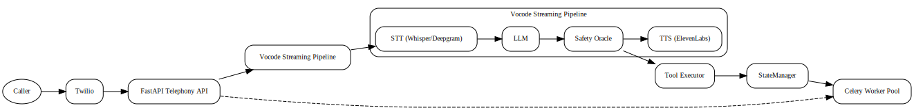

# TEL3SIS – Telephony‑Linked Embedded LLM System 

> **Codename:** TEL3SIS  
> A real‑time, voice‑first, agentic platform built on top of **vocode‑python** to answer incoming phone calls, hold natural LLM‑powered conversations, use external tools (Google Calendar, Weather, SMS, Email), record & transcribe audio, and hand off to a human seamlessly.

---

## ✨ Key Features & Current Development Focus

| Capability | Status | Notes |
|------------|--------|-------|
| Real‑time STT ↔️ LLM ↔️ TTS loop | ✅ Phase 1 | Whisper / Deepgram + GPT‑4o + ElevenLabs |
| Call recording & transcription | 🔄 In Progress | Audio in `recordings/audio`, transcripts in `recordings/transcripts` (Issue #453) |
| Toolchain via OpenAI Function Calling | 🔄 In Progress | Weather, Google Calendar, SMS/email (Issues #459, #433, #355, #354) |
| Context‑aware call forwarding | 🔄 In Progress | Whisper summary piped to human (Issue #430, #369, #411) |
| Tri‑layer memory (Redis + SQLite + Vectors) | 🔄 In Progress | Session ↔ Mid‑term ↔ Long‑term (Issues #334, #371, #396, #406, #448) |
| Safety oracle (pre‑execution) | 🔄 In Progress | Red‑team simulation + audit logs (Issues #442, #437, #461, #427) |
| Dashboard / metrics | 🔄 In Progress | Prometheus + Grafana (Issues #440, #441, #446, #445, #438, #429, #421, #375, #341, #305, #293) |
| CI / CD & DevSecOps | 🔄 In Progress | Git‑secrets, pytest, pre‑commit (Issues #447, #434, #462, #345, #336, #378, #392, #331) |
| Authentication & Authorization | 🔄 In Progress | OAuth2, 2FA, API Keys, RBAC (Issues #457, #455, #315, #424, #445) |
| Core Agent Configuration & Logic | 🔄 In Progress | Unified CLI, error handling, state management (Issues #451, #450, #426, #439, #329, #330, #389, #372, #304, #319, #365, #351, #324, #327, #295) |
| System Health & Monitoring | 🔄 In Progress | Healthchecks, logging, alerts (Issues #337, #416, #409, #376, #356, #344, #300) |
| Data Management & Persistence | 🔄 In Progress | Backup/Restore, pruning, transactional updates (Issues #463, #448, #387, #380, #401, #406) |
| API & CLI Development | 🔄 In Progress | Versioning, documentation, user management (Issues #428, #381, #335, #351) |
| Environment & Configuration | 🔄 In Progress | Centralized config, .env management (Issues #444, #425, #382, #373, #325) |
| Docker & Deployment | 🔄 In Progress | Image optimization, Kubernetes (Issues #435, #361, #246, #247, #419, #410) |

---

## 🏗️ High‑Level Architecture




---

## 📂 Directory Layout

```
TEL3SIS/
├── agents/               # Core & tool‑aware agent configs
├── server/               # FastAPI entrypoint, Celery, State Management
├── tools/                # Calendar, Weather, SMS, etc.
├── scripts/              # Development helpers and startup tasks
├── admin-ui/             # React dashboard (optional)
├── tasks.yml             # Swarm task manifest
├── docker-compose.yml
├── Dockerfile
├── requirements.txt
└── README.md
```

---

## 🚀 Quick‑Start (Development)

**Prerequisites:** Git, Docker (+ Docker Compose), and [ngrok](https://ngrok.com) must be installed locally.

1. **Clone & enter repo**

   ```bash
   git clone https://github.com/yourname/TEL3SIS.git
   cd TEL3SIS
   ```

2. **Install Python dependencies & pre-commit hooks**

   ```bash
   pip install -r requirements.txt
   pre-commit install
   ```
   This installs git hooks to automatically run `black`, `ruff`, and `git-secrets`.

3. **Create `.env`**

   ```bash
   cp .env.example .env
   # ➜ Populate with Twilio, OpenAI, ElevenLabs, Deepgram, EMBEDDING_PROVIDER, EMBEDDING_MODEL_NAME, etc.
   ```

4. **Launch stack**

   ```bash
   docker compose up --build
   ```

5. **Expose to Twilio (for inbound calls)**

   ```bash
   ngrok http 3000
   # Copy the `https` URL and paste it into your Twilio Console's Voice Webhook for your number (e.g., `https://xxxx.ngrok.io/inbound_call`).
   ```

6. **Call your Twilio number** – if TEL3SIS answers, Phase 1 is alive.

7. **Open Grafana (for monitoring)**

   Visit [http://localhost:3000/d/tel3sis-latency](http://localhost:3000/d/tel3sis-latency) (default login `admin`/`admin`).
   If the dashboard does not exist yet, import `ops/grafana/tel3sis.json` via **Dashboard → Import**.

8. **Launch the React Admin UI (optional)**

   ```bash
   cd admin-ui
   npm install
   npm run dev
   ```

### React Admin UI

Open [http://localhost:5173](http://localhost:5173) to access the dashboard. The app communicates with the FastAPI backend running on port 3000.

## 📑 API Reference & Documentation

- Detailed examples for every `/v1` endpoint can be found in [docs/api_usage.md](docs/api_usage.md).
- For a deep dive into the system design, see the [core logic architecture review](docs/reviews/core_logic_architecture_review.md).
- Production deployment recommendations are covered in [docs/production.md](docs/production.md).
- A comprehensive user guide is being developed (Issue #464).
- An Admin UI guide is being developed (Issue #449).
- Configuration variables are being documented (Issue #444).
- API and CLI references are being published (Issue #381).
- Pre-commit hooks are being documented (Issue #392).
- A contribution style guide is being developed (Issue #276).
- A production deployment guide is being developed (Issue #272).

---
**Local (non‑Docker) setup**  
```bash
python -m venv venv
source venv/bin/activate
pip install -r requirements.txt
uvicorn server.app:create_app --factory --reload
```
> Use this only for lightweight debugging; Docker remains the canonical environment.

### Local development and testing

Set up a virtual environment with all development dependencies to run the test suite and pre-commit hooks:

```bash
python -m venv venv
source venv/bin/activate
pip install -r requirements-dev.txt
pre-commit install
pytest -q
```

### Test dependencies

The development requirements include several libraries used by the test suite:

- `pytest` and `pytest-asyncio` – test framework
- `celery` – background task queue for integration tests
- `fakeredis` – in-memory Redis used by unit tests
- `numpy` and `scikit-learn` – required by ChromaDB
- `ruff` and `pre-commit` – linting and git hooks

### USE_FAKE_SERVICES

Set `USE_FAKE_SERVICES=true` to run tests without needing Redis or any external
APIs. This uses `fakeredis` and mocked integrations. `tests/conftest.py` sets it
automatically so the suite works offline.

Run the helper script to create a virtual environment and install everything:

```bash
./scripts/setup_test_env.sh
```

---

## ⚙️ Environment Variables

| Key | Description |
|-----|-------------|
| `BASE_URL` | Public URL for webhook (ngrok / k8s ingress) |
| `TWILIO_ACCOUNT_SID` / `TWILIO_AUTH_TOKEN` | Twilio credentials for SMS and escalation |
| `OPENAI_API_KEY` | LLM access |
| `ELEVEN_LABS_API_KEY` | TTS voice |
| `EMBEDDING_PROVIDER` | `openai` or `sentence_transformers` |
| `EMBEDDING_MODEL_NAME` | SentenceTransformers model name or path |
| `OPENAI_EMBEDDING_MODEL` | Model name when using OpenAI embeddings |
| `REDIS_URL` | Redis connection for state & Celery broker |
| `CELERY_BROKER_URL` | Broker URL for Celery |
| `CELERY_RESULT_BACKEND` | Result backend for Celery |
| `DATABASE_URL` | SQLite / Postgres for mid‑term memory |
| `ESCALATION_PHONE_NUMBER` | Phone number used when handing off calls |
| `TWILIO_PHONE_NUMBER` | Default caller ID for outbound SMS and calls |
| `TOKEN_ENCRYPTION_KEY` | Base64 AES key for encrypting OAuth tokens |
| `GOOGLE_CLIENT_ID` / `GOOGLE_CLIENT_SECRET` | OAuth credentials for Calendar |
| `SENDGRID_API_KEY` | SendGrid API key for email notifications |
| `SENDGRID_FROM_EMAIL` | Sender email address for SendGrid |
| `NOTIFY_EMAIL` | Recipient for call transcripts |
| `USE_FAKE_SERVICES` | Use `fakeredis` and mocked APIs for tests |
| _see `.env.example` for a complete list_ |

### Generating and Storing the Encryption Key

The `TOKEN_ENCRYPTION_KEY` must be a persistent 128‑bit AES key encoded in
base64. Generate one using:

```bash
python - <<'EOF'
import base64, os
print(base64.b64encode(os.urandom(16)).decode())
EOF
```

Add the resulting value to your `.env` file under `TOKEN_ENCRYPTION_KEY` before
starting the server. The decoded key must be exactly 16 bytes (AES‑128).
Example:

```bash
TOKEN_ENCRYPTION_KEY="$(python - <<'EOF'
import base64, os
print(base64.b64encode(os.urandom(16)).decode())
EOF
)"
```

Without this key, TEL3SIS will refuse to launch.

---

## 🛠️ Development Workflow

| Phase | Lead Tasks | Branch Tag |
|-------|------------|------------|
| **0 Init** | `INIT-00` → `INIT-04` | `init/` |
| **1 Core** | `CORE-01` → `CORE-06` + `OPS-01` | `core-mvp/` |
| **2 Tools** | `MEM-01`, `TOOL-01`–`05`, `OPS-02` | `tools/` |
| **3 Handoff** | `FWD-01`–`04` | `handoff/` |
| **4 Memory** | `MEM-02`, `MEM-03`, `QA-01` | `memory/` |
| **5 Safety** | `SAFE-01`–`03`, `SEC-01` | `safety/` |
| **6 UI/Ops** | `MON-01`, `UI-01`–`03` | `ui-ops/` |

Use feature branches named `<phase>/<task_id>-short-desc`, then open a PR referencing the task ID in **`tasks.yml`**.

---

## 🧪 Testing

Install development dependencies first:

```bash
pip install -r requirements-dev.txt
pytest -q
```

* Unit tests live under `tests/`
* End‑to‑end call emulation via `tel3sis dev-call`
* STT latency reduction via `tel3sis warmup`
* Management commands via `tel3sis manage`

### Ongoing Testing & QA Initiatives

- Add unit tests for `StateManager` and `TokenStore` (Issue #450).
- Add tests for CLI and tool error cases (Issue #458).
- Implement property-based call-flow tests (Issue #390).
- Set up local microphone/speaker test script (Issue #367).
- Add integration tests for CLI and endpoints (Issue #362).
- Create shared `vocode` mocking utility for tests (Issue #245).
- Test Docker Compose deployment (Issue #247).

---

## 📊 Monitoring

* **Prometheus** scraps `/metrics` exposed by the FastAPI app
* Alert rules live in `ops/prometheus/*_rules.yml` and define when latency is too high
  or HTTP errors spike
* Alerts trigger if STT/LLM/TTS average latency stays above **3 s** for over a minute
* Alertmanager reads `ops/prometheus/alertmanager.yml` and posts to Slack via `SLACK_WEBHOOK_URL`
  or PagerDuty via `PAGERDUTY_ROUTING_KEY` in `.env`
* Browse Grafana at [http://localhost:3000/d/tel3sis-latency](http://localhost:3000/d/tel3sis-latency).
  Import `ops/grafana/tel3sis.json` if the dashboard is missing to view latency and task metrics.

### Ongoing Monitoring & Observability Initiatives

- Provision Grafana dashboard (Issue #440).
- Instrument Application with Prometheus Metrics (Issue #376).
- Implement latency logger with loguru (Issue #356).
- Configure Prometheus alert rules (Issue #344).
- Set Up Alertmanager for Critical Alerts (Issue #409).
- Centralized log forwarding (Issue #416).

---

## 🔐 Security

* All secrets loaded from `.env` (never committed)
* `git-secrets` pre‑commit hook blocks accidental key leaks
* OAuth tokens are AES‑GCM encrypted via `cryptography` before storage
* Safety Oracle filters any risky LLM output before TTS

### Ongoing Security Initiatives

- Set up GitHub Actions security scan (Issue #462).
- Design Secure OAuth2 Onboarding Flow (Issue #457).
- Two-factor authentication (Issue #455).
- Container image security scanning (Issue #345).
- Add dependency vulnerability scanning to CI/CD (Issue #336).
- Implement fallback for tool auth failure (Issue #420).
- Custom banned phrase lists (Issue #427).
- Persistent Encryption Key (Issue #388).
- API key authentication (Issue #315).
- Rate limiting and abuse protection (Issue #357).

---

## 🖇️ Tool Plugins (Phase 2)

| Tool | Trigger Example | Implementation |
|------|-----------------|----------------|
| **Weather** | “What’s the weather tomorrow?” | OpenWeatherMap REST |
| **Calendar** | “Book a meeting at 10 AM” | Google Calendar API + OAuth |
| **SMS/Email** | “Text me the transcript” | Twilio Messages / SendGrid |
| **Browser** | “Open example.com” | Browser Use library |

_Add new tool by implementing `tools/<name>.py` and registering JSON schema in `agents/tools_registry.py`._

### Ongoing Tool Development

- Integrate simple tool: weather API (Issue #459).
- Build Google Calendar tool with OAuth (Issue #433).
- Translation tool (Issue #355).
- Add OpenAI function-calling support to agent (Issue #354).
- Knowledge base FAQ tool (Issue #423).
- Refactor Tools for Dynamic Invocation (Issue #389).

### Notifications

Transcripts can be sent automatically once SendGrid and Twilio credentials are configured. Set:

- `SENDGRID_API_KEY` and `SENDGRID_FROM_EMAIL` – enables `send_email()`
- `NOTIFY_EMAIL` – default email recipient
- `TWILIO_ACCOUNT_SID` and `TWILIO_AUTH_TOKEN` – enables `send_sms()`
- `ESCALATION_PHONE_NUMBER` – destination for escalation SMS

If these variables are unset, the system logs a warning and skips the notification.

---

## 🤝 Contributing

1. Fork & clone
2. Check open issues in **`tasks.yml`**
3. Branch ➜ code ➜ `pytest` ➜ PR
4. PR must pass CI + receive one approval
5. Install the hooks described in [CONTRIBUTING.md](CONTRIBUTING.md)

We follow the **Conventional Commits** spec.

---

## 🚀 Releases

Tag a version using `v*` to build and publish the Docker image. Example:

```bash
git tag v0.1.0
git push origin v0.1.0
```

The release workflow publishes `ghcr.io/<org>/tel3sis:<tag>`. Pull it with:

```bash
docker pull ghcr.io/<org>/tel3sis:v0.1.0
```

### Ongoing Release & Deployment Initiatives

- Publish Docker image on release (Issue #246).
- Develop production deployment guide (Issue #272).

---

## 🗺️ Roadmap & Future Development

This section outlines key areas of ongoing and future development, linking directly to relevant GitHub Issues for detailed tracking.

### Core Agent & AI Capabilities

- **Self-Reflection & Learning:** Implementing routines for the agent to critique its own performance and learn from interactions (Issue #454).
- **Advanced Dialogue Management:** Developing multi-turn dialogue state machines and intent recognition for more sophisticated conversations (Issues #372, #304, #295).
- **Multilingual Support:** Expanding the agent's ability to handle and respond in multiple languages (Issue #327).
- **Conversation Summarization:** Enhancing the agent's ability to summarize conversations for various purposes (Issue #324, #369).
- **Escalation Triggers:** Adding more sophisticated triggers for human handoff (Issue #436).

### Data & Memory Management

- **Semantic Memory:** Integrating advanced memory solutions like ChromaDB or pgvector for long-term knowledge retention (Issue #334).
- **Memory Retrieval:** Developing summarization-aware memory retrieval mechanisms (Issue #396).
- **Call Data Persistence:** Ensuring robust persistence of call summaries and preferences (Issue #406).
- **Vector Store Pruning:** Implementing strategies for managing the growth of the vector store (Issue #448).
- **Transactional State Updates:** Ensuring data consistency across state changes (Issue #380).

### System Architecture & Performance

- **Asynchronous Database Migration:** Migrating to an async database driver for improved performance (Issue #401).
- **Celery Worker Integration:** Introducing Celery workers for background task processing (Issue #410).
- **Configuration Management:** Centralizing and streamlining environment configuration (Issues #425, #373, #382, #325).
- **Healthcheck Endpoints:** Implementing robust health checks for all services (Issue #337).
- **API Versioning:** Establishing a versioned API with validation (Issue #428).

### Admin UI & User Experience

- **Conversation Log Viewer:** Implementing a comprehensive viewer for past conversations (Issue #421).
- **Dashboard Actionability:** Adding actions like deleting or reprocessing calls directly from the dashboard (Issue #293).
- **Dashboard Enhancements:** Improving filtering, sorting, and pagination for the dashboard (Issue #305).
- **Dark Mode:** Implementing a dark mode for the Admin UI (Issue #322).

### Development & Operations

- **Devcontainer Support:** Providing development container configurations for easier onboarding (Issue #419).
- **Dependency Management:** Adopting `pip-tools` for more controlled dependency management (Issue #306).
- **Automated Dependency Updates:** Automating the process of updating dependency locks (Issue #402).
- **Container Image Security:** Implementing container image security scanning (Issue #345).
- **Dependency Vulnerability Scanning:** Adding vulnerability scanning to CI/CD (Issue #336).
- **Local Test Script:** Setting up a local microphone/speaker test script (Issue #367).
- **Unified CLI:** Providing a unified `tel3sis` CLI for various management tasks (Issue #351).
- **User Management CLI:** Expanding CLI capabilities for user management (Issue #335).
- **Data Retention Cleanup:** Implementing jobs for data retention and cleanup (Issue #387).

---

## 📜 License

MIT. See `LICENSE`.

---

> Crafted with ♥ by **Adrian Wedd** & the TEL3SIS Swarm. Contributions welcome!